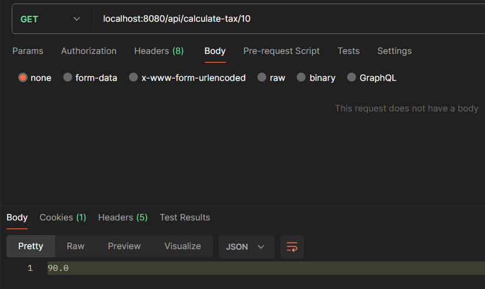

## TaxCalculationSystem

## Description
This project is a rest api project that calculates the tax of products.

## Dependencies
- Mysql Database
- Mysql Workbench
- JDK 21
- Maven
- Git
- Eclipse or any other java IDE
- Postman - Client

## Spring Dependencies
- spring-boot-starter-data-jpa
- spring-boot-starter-web
- spring-boot-devtools
- mysql-connector-j
- spring-boot-maven-plugin

## Running the project
- Download project this url: https://github.com/Ertugrulctnk/TaxCalculationSystem.git
- Open the project to IDE
- Maven dependencies install
- Setting mysql connection details for application.properties
- Run to project
- Open the Postman
- Testing the rest services endpoints

## Endpoints

* Product /api/product 
	*GET 	/getAll 
	*POST 	/add 
	*GET /getById/{productId} 
	*PUT /update 
	*DELETE /delete/{productId}  
	
*	Customer /api/customer 
	*POST/add  
	
* TaxRate /api  
	*GET /calculate-tax/{productId} 
	
	
## Features
- A client can create new product in the service
- A client can create new customer in the service
- A client can find product by id
- A client can modify its own products but cannot modify others’ products
- A client can delete its own products but cannot modify others’ products
- A client can view all products in the service
- A client can calculate the tax of the product

## Error Messages
- Error occurred while adding customer
- Error adding product
- You can only update your own products.
- You can only delete your own products.	
- The product you were looking for was not found
- The owner of this product is not set

## Test Scenarios İmages For Postman

  
  
  
  
  
  
  
  
  
  

